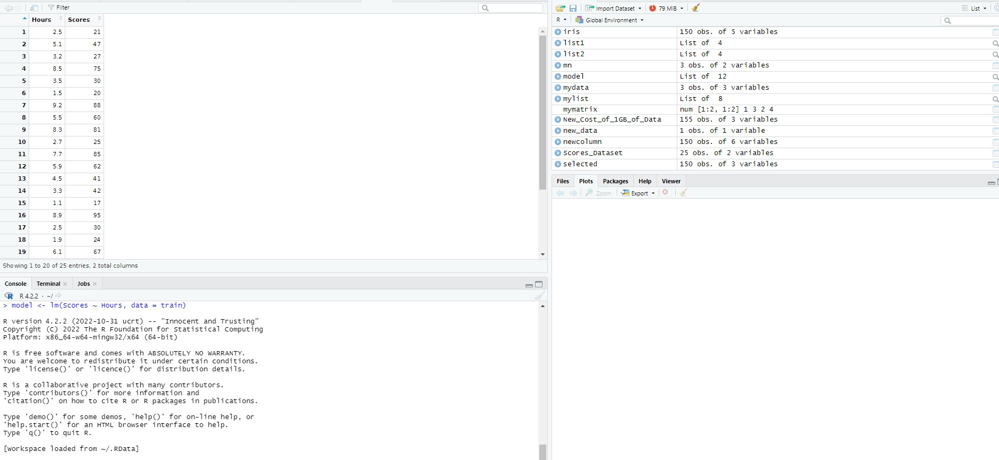

# Prediction-Using-Supervised-ML-in-R

## Introduction
This is a GRIP task analysis that requires use of python to carry out prediction using Supervised ML of the given data. In this task, A prediction of the percentage of marks that a student is expected to score based upon the number of hours they studied. 

## Problem Statement 
The aim of this analysis is to answer the following business related questions:
- Predict the percentage of students based on the no. of study hours?
- What will be the predicted score if a student studies for 9.25hrs/day?

## Methodology:
- Loading the data
- Exploratory Data Analysis
- Visualizing the data
- Splitting, modelling and training the data
- Conclusion

## Skills, Concept & Library used:
- ggplot2
- caret
- modelling
- statistical analysis
- visualization
- data manipulation
- critical thinking

# Loading the Data

The data was viewed after loading it in R using the view(df) code

# Exploring the Data

Furthermore, statistical analysis was carried out on the target variable.

# Visualizing the Data

The above visual gives understanding of how normally distributed the target variable is. We notice a slight skewness to the right.

The above visual shows us the relationship between the target variable and associate variable. This clearly shows a linear relationship meaning as the hours of reading increases, the scores increase.

## Conclusion 
The predicted Score if a student studies for 9.25 hours/day is approximately 93.33%.

## All Analysis are explained in details in the R file.
